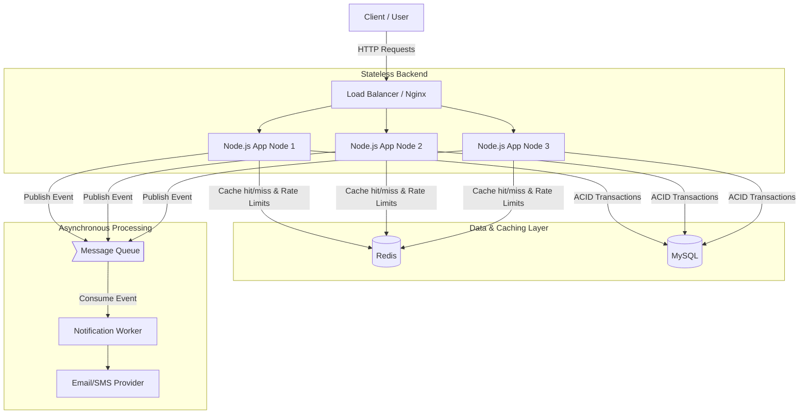
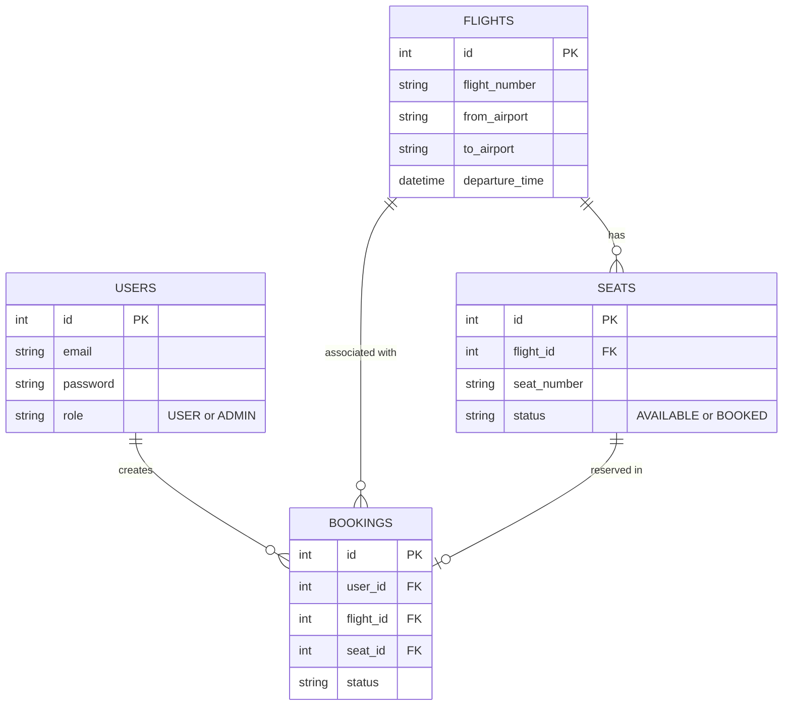
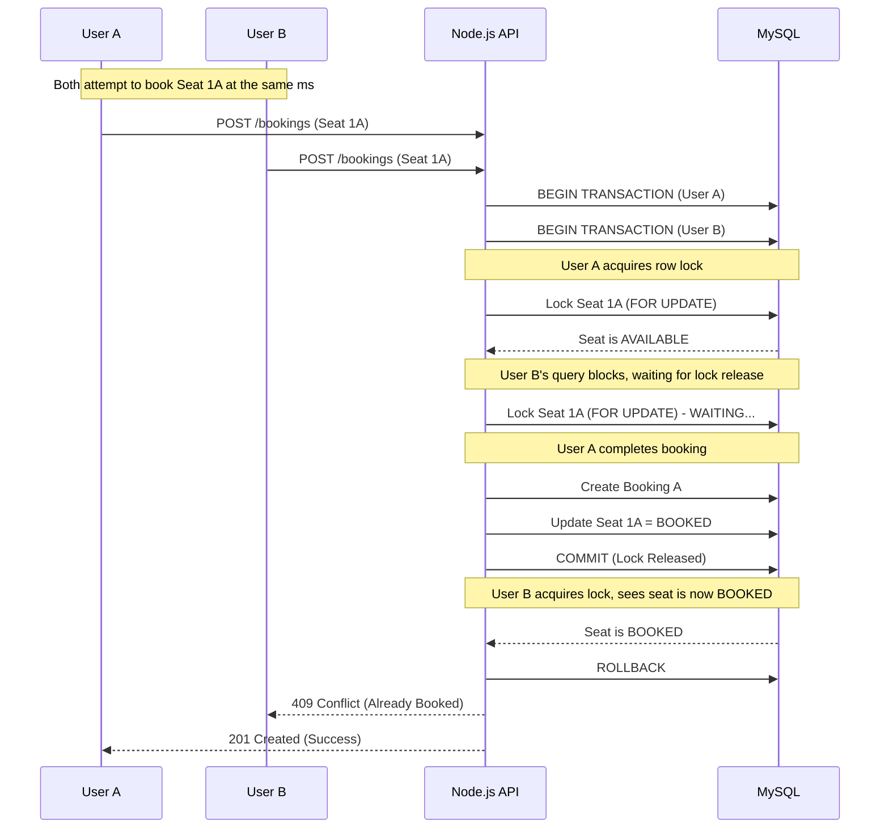
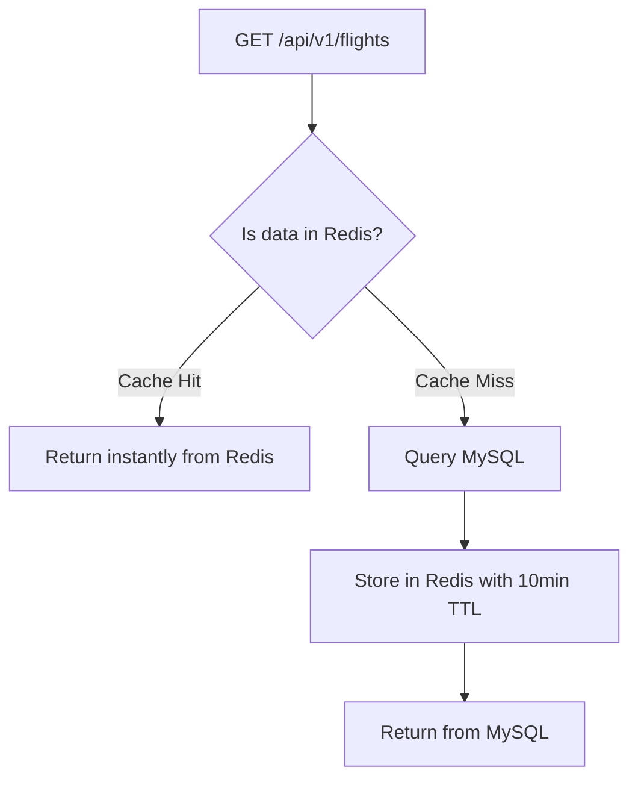
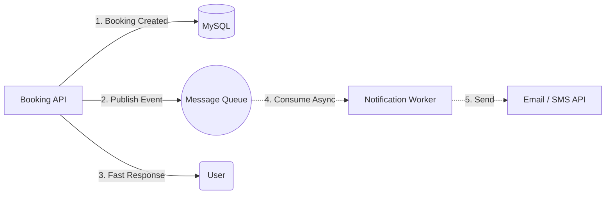

# 🛫 High-Concurrency Flight Booking System

[](https://github.com/AkashSingh040)
[](https://opensource.org/licenses/MIT)

A highly scalable, concurrent flight booking system built as an Intensive System Design & Node.js Architecture Project. This project serves as a comprehensive demonstration of designing production-ready backends, handling race conditions, optimizing performance with caching, and decoupling tasks using message queues.

Every technology in this stack was carefully chosen to solve a specific engineering problem—adhering to a strict "no resume-driven development" philosophy.

---

## 🛠️ Core Stack & Justification

- **Node.js & Express:** Event-driven, non-blocking I/O perfect for a high-throughput, network-heavy application.
- **MySQL:** Relational data integrity for ACID compliance, essential for transactional operations like booking flights and locking seats.
- **Redis:** High-speed in-memory datastore used for caching flight searches and implementing distributed rate limiting.
- **Message Queue (Kafka/RabbitMQ concepts):** Asynchronous event-driven architecture to offload non-critical tasks (like email/SMS notifications) and ensure reliability.
- **React/Vite (Future Scope):** Fast, modern frontend tooling.

---

## 🏗️ System Architecture

This represents the final targeted architecture design (Phase 10), showcasing how requests flow through load balancers, application nodes, caching layers, databases, and background workers.



---

## 🗄️ Database Schema

The core relational data model representing the entities and relationships.



---

## 🚀 Architecture Evolution: Phase-by-Phase Breakdown

This section serves as a memory refresher for all the concepts implemented and features built during the development of this project.

### Phase 1: Node.js + HTTP Foundation
- **Concepts Mastered:** V8 Engine, Event Loop, Call Stack, Callback Queue, Non-blocking I/O.
- **Implementation:** Created the initial barebones backend, understanding how HTTP requests/responses work fundamentally before introducing frameworks.
- **Key Takeaway:** Node.js is single-threaded for execution but utilizes worker threads for async I/O, making it highly efficient for web servers.

### Phase 2: Express Architecture
- **Concepts Mastered:** Middleware, routing, separation of concerns (Controllers vs. Services vs. Repositories).
- **Implementation:** Segregated routes, controllers, and services. Implemented a centralized error handler.
- **Key Takeaway:** Never put business logic in route handlers. Middleware acts as a pipeline for processing requests (e.g., parsing, logging, error handling).

### Phase 3: REST API Design
- **Concepts Mastered:** Resource naming conventions, appropriate HTTP methods (GET, POST, PUT, PATCH, DELETE), HTTP status codes, API versioning.
- **Implementation:** Built paginated, filterable, and sortable flight search APIs (`/api/v1/flights?from=SXR&to=DEL&page=1&limit=10`). Standardized API responses.
- **Key Takeaway:** Good API design relies on statelessness and consistent data shapes, making it predictable for frontend consumption.

### Phase 4: MySQL + Data Layer
- **Concepts Mastered:** Joins, foreign keys, indexing strategies, connection pooling, SQL injection prevention.
- **Implementation:** Configured a connection pool, set up the schema, built the Repository layer, and added indexes to optimize flight search queries.
- **Key Takeaway:** Indexes drastically speed up read queries but slow down write operations. Connection pooling prevents the overhead of creating a new DB connection for every request.

### Phase 5: Authentication + Security
- **Concepts Mastered:** Passwords hashing (bcrypt), JWT (Access vs. Refresh tokens), Role-Based Access Control (RBAC), CORS.
- **Implementation:** Built registration and login flows. Added middleware to verify JWTs and authorize users based on roles (`USER` vs `ADMIN`).
- **Key Takeaway:** JWTs are stateless and cannot be natively revoked without a blacklist. Authentication verifies *who* you are; Authorization verifies *what* you can do.

---

### Phase 6: Booking, Transactions & Concurrency 🔥
*This is the most critical part of the system design—handling race conditions where two users attempt to book the exact same seat simultaneously.*

- **Concepts Mastered:** ACID properties, Database Locks, Race Conditions, Double Bookings, Idempotency.
- **Implementation:** Utilized MySQL transactions and **row-level locking** (`SELECT ... FOR UPDATE`) to guarantee that only one booking can succeed for a given seat.



---

### Phase 7: Redis + Caching
- **Concepts Mastered:** Cache-aside pattern, Time-To-Live (TTL), cache invalidation, cache stampede.
- **Implementation:** Cached high-volume flight search results in Redis. Implemented cache invalidation when flight details change.



### Phase 8: Rate Limiting + Scalability
- **Concepts Mastered:** Token bucket, sliding window algorithms, horizontal vs vertical scaling, stateless backends.
- **Implementation:** Added distributed rate limiting using Redis, restricting users to 100 requests/minute to prevent API abuse.
- **Key Takeaway:** Node.js instances must remain completely stateless (no in-memory sessions) so traffic can be load-balanced across multiple instances seamlessly.

### Phase 9: Queue + Reliability
- **Concepts Mastered:** Asynchronous processing, producer/consumer patterns, retries, dead-letter queues, idempotent workers.
- **Implementation:** Instead of waiting for a notification API to respond during a booking, the API publishes a "Booking Created" event to a queue. A separate background worker picks this up to send the email/SMS.



---

## 🔮 Future Scope (Phase 10)

The final phase will bring the application to a production-ready state:
1. **Observability:** Structured application logging (e.g., Winston/Pino) and health check endpoints.
2. **Resilience:** Graceful server shutdown to drain existing connections before stopping.
3. **Containerization:** Dockerizing the Node.js application for consistent deployments.
4. **Traffic Routing:** Nginx basics for reverse proxying and load balancing.

---

## 📝 Interview Concept Cheatsheet

If asked about this project in an interview, refer back to these core concepts:
- **Why Node.js?** Event-driven architecture handles high I/O concurrency efficiently.
- **How did you prevent double booking?** ACID transactions + Row-Level locking (`SELECT FOR UPDATE`).
- **What happens if the app crashes during booking?** The DB transaction rolls back; no half-completed data.
- **Why Redis for rate limiting instead of in-memory?** Distributed systems need a centralized truth for request counts; in-memory limits fail when load balanced across multiple nodes.
- **Why use a Queue for notifications?** Decoupling. The user shouldn't wait for a slow third-party email API to return before seeing their booking confirmation.

---

## 💻 Getting Started

```bash
# Clone the repository
git clone <repository-url>

# Install dependencies
cd server
npm install

# Setup environment variables
# Duplicate .env.example to .env and fill in your MySQL & Redis credentials

# Run the development server
npm run dev
```

---

## 👨‍💻 Author

**Akash Singh**
- **GitHub:** [@AkashSingh040](https://github.com/AkashSingh040)
- **LinkedIn:** [Akash Singh](https://www.linkedin.com/in/akash-singh040/) 
